# 📚 Vidya Setu

<div align="center">


<p align="center">
  
</p>


</div>

---

<div align="center">

## 🌟 **Vision Statement**

</div>

<div align="center">

</div>

**Vidya Setu** is a centralized student project management platform that bridges the gap between students, faculty, and administrators. It ensures streamlined project submission, monitoring, and evaluation within a single system.

The platform serves both as an **academic submission system** (institutional style) and a **developer-friendly repository** (open-source style) to encourage transparency, scalability, and collaboration.

<div align="center">

---

## ✨ Features

</div>

<table align="center">
<tr>
<td align="center" width="33%">

### 🎯 Core Functionality
<br/>
**Centralized Project Repository** - Store and manage all student projects in one organized location<br/>
**Role-Based Access Control** - Distinct interfaces for Students, Faculty, and Administrators<br/>
**Team Collaboration Tools** - Multi-user project management with milestone tracking<br/>
**Advanced Search & Filtering** - Find projects by title, student, department, or technology stack<br/>
**Version Control Integration** - Seamless GitHub/GitLab repository linking

</td>
<td align="center" width="33%">

### 👥 User Roles
<br/>
**Students**: Upload projects, track progress, collaborate with teams<br/>
**Faculty/Mentors**: Evaluate submissions, provide feedback, monitor milestones<br/>
**Administrators**: Manage users, departments, and oversee project lifecycle

</td>
<td align="center" width="33%">

### 🔒 Security & Authentication
<br/>
JWT-based secure authentication<br/>
Password encryption with bcrypt<br/>
Role-based permission system<br/>
File upload validation and security

</td>
</tr>
</table>

<div align="center">

---

## 🛠️ Tech Stack

</div>

<div align="center">

### Frontend


**React** with Vite for fast development  
**TailwindCSS** + **Shadcn UI** for modern styling  
**Axios** for API communication

### Backend


**Node.js** + **Express.js** server  
**MongoDB** + **Mongoose** ODM  
**JWT** authentication  
**Multer** + **GridFS** for file handling

### DevOps & Deployment


**GitHub Actions** for CI/CD  
**Docker** for containerization  
**MongoDB Atlas** cloud database  
**Nginx** for production deployment

</div>

<div align="center">

---

## 📂 Project Structure

</div>

```
📁 Vidya_Setu/
├── 📁 backend/
│   ├── 📁 config/          # Database & environment configuration
│   ├── 📁 models/          # MongoDB schemas and data models
│   ├── 📁 routes/          # Express API endpoints
│   ├── 📄 gridfs.js        # GridFS file storage setup
│   ├── 📄 seedData.js      # Sample data seeding
│   ├── 📄 server.js        # Backend application entry point
│   ├── 📄 upload.js        # File upload middleware
│   └── 🔒 .env             # Environment variables
│
├── 📁 src/
│   ├── 📁 assets/          # Static resources (images, icons)
│   ├── 📁 components/      # Reusable React components
│   ├── 📁 data/            # Static and mock data
│   ├── 📁 styles/          # CSS and Tailwind configurations
│   ├── 📄 AdminDashboard.jsx
│   ├── 📄 AdminLogin.jsx
│   ├── 📄 AdminPage.jsx
│   ├── 📄 App.jsx          # Main React application
│   ├── 📄 FacultyApprovalPage.jsx
│   ├── 📄 FacultyDashboard.jsx
│   ├── 📄 FacultyLogin.jsx
│   ├── 📄 FacultyPage.jsx
│   ├── 📄 FacultyProfile.jsx
│   ├── 📄 FacultySettings.jsx
│   ├── 📄 HomePage.jsx
│   ├── 📄 main.jsx         # React application entry point
│   ├── 📄 StudentLogin.jsx
│   ├── 📄 StudentPage.jsx
│   └── 📄 StudentProfile.jsx
│
├── 📄 .gitignore
├── 📄 index.html
├── 📄 package-lock.json
├── 📄 package.json
├── 📄 README.md
└── 📄 vite.config.js
```

<div align="center">

---

## ⚙️ Installation & Setup

</div>

<div align="center">

</div>

### Prerequisites
- **Node.js** (version 18 or higher)
- **MongoDB** (local installation or Atlas account)
- **Git** for version control

### 🚀 Quick Start

<details>
<summary><b>🔽 Click to expand installation steps</b></summary>

1. **Clone the Repository**
   ```bash
   git clone https://github.com/your-username/Vidya_Setu.git
   cd Vidya_Setu
   ```

2. **Backend Setup**
   ```bash
   cd backend
   npm install
   ```

3. **Environment Configuration**
   
   Create a `.env` file in the `backend/` directory:
   ```env
   MONGODB_URI=mongodb://localhost:27017/vidya_setu
   JWT_SECRET=your-super-secret-jwt-key
   PORT=5000
   NODE_ENV=development
   ```

4. **Start Backend Server**
   ```bash
   npm start
   # Server will run on http://localhost:5000
   ```

5. **Frontend Setup** (in a new terminal)
   ```bash
   cd src
   npm install
   npm run dev
   # Frontend will run on http://localhost:5173
   ```

6. **Access the Application**
   
   Open your browser and navigate to: **[http://localhost:5173](http://localhost:5173)**

</details>

<div align="center">

---

## 🚀 Deployment Options [PROJECT NOT DEPLOYED YET]

</div>

<div align="center">

</div>

<table align="center">
<tr>
<td align="center" width="33%">

### Frontend Deployment
<br/>
**Vercel** (Recommended for React apps)<br/>
**Netlify** (Static site hosting)<br/>
**GitHub Pages** (For static builds)

</td>
<td align="center" width="33%">

### Backend Deployment
<br/>
**Render** (Full-stack applications)<br/>
**Heroku** (Platform as a Service)<br/>
**Railway** (Modern deployment platform)<br/>
**Docker + VPS** (Self-hosted option)

</td>
<td align="center" width="33%">

### Database
<br/>
**MongoDB Atlas** (Recommended cloud solution)<br/>
**MongoDB Community** (Self-hosted)

</td>
</tr>
</table>

<div align="center">

---

## 🤝 Contributing

</div>

<div align="center">

</div>

We welcome contributions from the community! Here's how you can help:

```mermaid
gitGraph
    commit id: "Fork Repo"
    branch feature
    checkout feature
    commit id: "Add Feature"
    commit id: "Write Tests"
    commit id: "Update Docs"
    checkout main
    merge feature
    commit id: "Deploy 🚀"
```



1. **Fork** the repository
2. **Create** a feature branch (`git checkout -b feature/amazing-feature`)
3. **Commit** your changes (`git commit -m 'Add amazing feature'`)
4. **Push** to the branch (`git push origin feature/amazing-feature`)
5. **Open** a Pull Request

### Development Guidelines
- Follow existing code style and conventions
- Write clear, descriptive commit messages
- Include tests for new features
- Update documentation as needed

<div align="center">

---

## 👨‍💻 Contributors

</div>

<div align="center">

<a href="https://github.com/JashT14/Vidya_Setu/graphs/contributors">
  
</a>

<table>
<tr>
<td align="center">
<br/>
<b>Jash Thakkar</b><br/>
Backend Developer<br/>
</td>
<td align="center">
<br/>
<b>Hetansh Waghela</b><br/>
ML Developer<br/>
</td>
<td align="center">
<br/>
<b>Darshan Ved</b><br/>
Frontend Developer<br/>
</td>
<td align="center">
<br/>
<b>Vraj Ved</b><br/>
Frontend Developer<br/>
</td>
<td align="center">
<br/>
<b>Nikhil Pise</b><br/>
ML Developer<br/>
</td>
</tr>
</table>

</div>

<div align="center">

---

## 📞 Contact & Support

</div>

<div align="center">

</div>

<div align="center">

[](https://github.com/JashT14/Vidya_Setu)
[](https://github.com/your-username/Vidya_Setu/issues)
[](https://github.com/your-username/Vidya_Setu/discussions)

</div>

- **Project Repository**: [https://github.com/JashT14/Vidya_Setu](https://github.com/JashT14/Vidya_Setu)
- **Issue Tracker**: [GitHub Issues](https://github.com/your-username/Vidya_Setu/issues)
- **Discussions**: [GitHub Discussions](https://github.com/your-username/Vidya_Setu/discussions)

<div align="center">

---

## ⭐ Show Your Support

</div>

<div align="center">

</div>

If you find this project helpful, please consider:
- ⭐ **Starring** the repository
- 🍴 **Forking** for your own projects
- 🐛 **Reporting** bugs and issues
- 💡 **Suggesting** new features

<div align="center">

---

## 📜 License

</div>

<div align="center">

[](https://www.gnu.org/licenses/gpl-3.0)

This project is licensed under the **GNU General Public License v3.0** - see the [LICENSE](LICENSE) file for details.

</div>

<div align="center">

---


**Made with ❤️ by the GitGoneWild Team**


</div>
